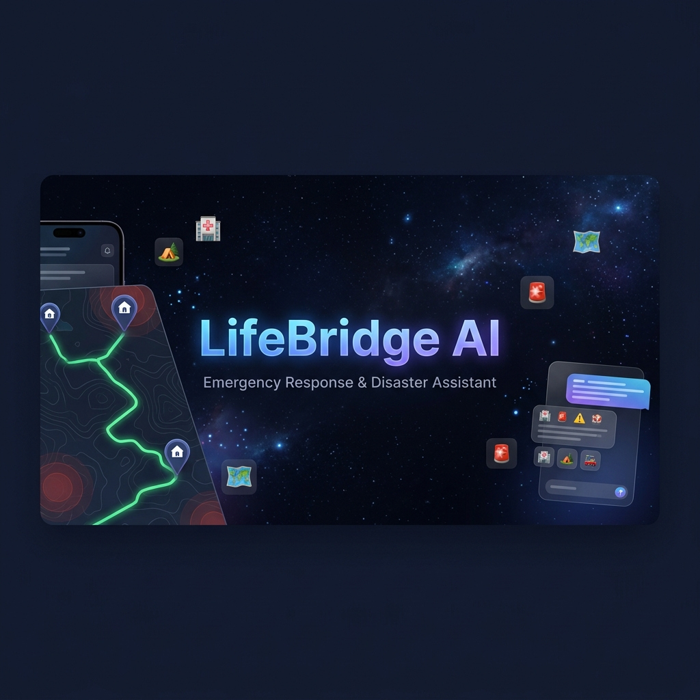
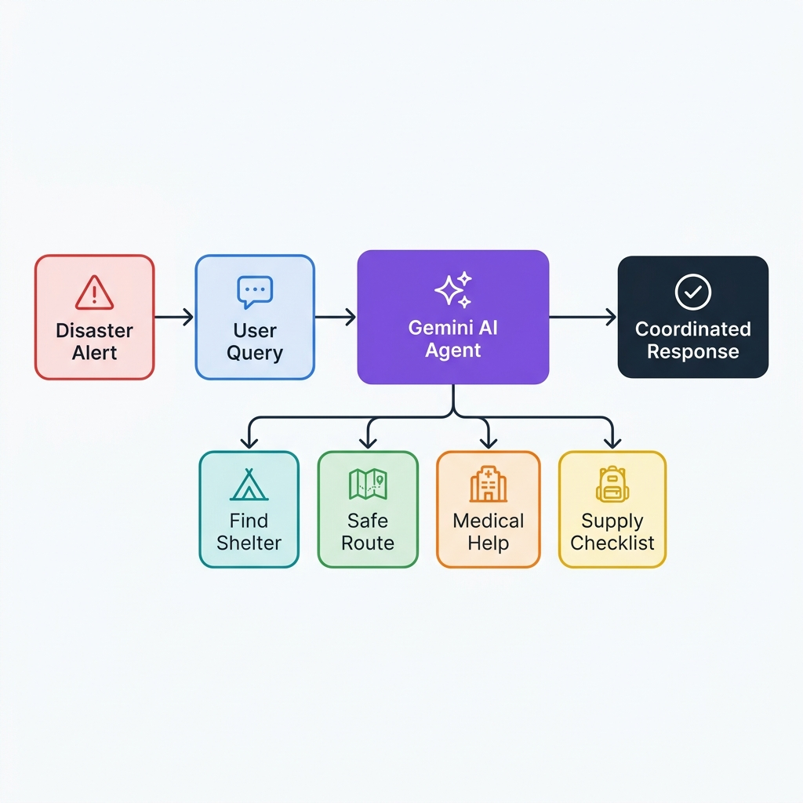

# 🌉 LifeBridge AI — Emergency Response & Disaster Assistant

<div align="center">



[](https://github.com)
[](https://github.com)
[](https://leafletjs.com)
[](https://github.com)
[](https://github.com)

**When floods, earthquakes, cyclones, or accidents happen — people need answers fast.**

[Live Demo](#) · [Report Bug](https://github.com/issues) · [Request Feature](https://github.com/issues)

</div>

---

## 🚨 The Problem

When natural disasters strike, affected communities face four critical information gaps:

| Gap | Challenge |
|-----|-----------|
| 🏕️ **Shelters** | People don't know which shelters are open, their capacity, or how to reach them |
| 🗺️ **Routes** | Roads may be flooded, collapsed, or blocked — safe paths are unknown |
| 🏥 **Medical** | Nearest hospital, ER wait times, and ambulance availability are invisible |
| 🎒 **Supplies** | No clear checklist of what to pack before evacuating |

**LifeBridge AI** solves all four — with a single AI-powered, offline-first web application.

---

## 🤖 Gemini AI Agent — The Brain of LifeBridge

The core intelligence is a **multi-module Gemini Emergency Agent** built entirely client-side. It processes free-text natural language queries, identifies user intent with a weighted scoring engine, and **coordinates across 4 real-time modules simultaneously**.

### Agent Architecture



### 🧠 How The Agent Works

```
User Query (text)
      │
      ▼
┌─────────────────────────────────┐
│   Intent Classification Engine  │
│   (12 intents, weighted scoring)│
└──────────────┬──────────────────┘
               │
       ┌───────┴────────┐
       │ Top Intent(s)  │
       └───────┬────────┘
               │
    ┌──────────▼──────────────┐
    │   Thinking Steps UI     │ ← animated reasoning display
    └──────────┬──────────────┘
               │
    ┌──────────▼──────────────────────────────────────┐
    │          Module Orchestrator                     │
    │                                                  │
    │  🏠 find_shelter   → Leaflet map + route plot   │
    │  🗺️ safe_route     → Hazard-bypass polyline     │
    │  🏥 find_medical   → ER/bed data + route        │
    │  🎒 show_supplies  → Scenario-specific checklist│
    │  🚨 trigger_sos    → Strobe + GPS coordinates   │
    │  📊 situation_report → Full briefing            │
    │  🩹 first_aid_*    → Step-by-step protocols     │
    │  ⚠️ hazard_info    → Active zone mapping        │
    │  👨‍👩‍👧 family_checkin → Share status message     │
    └──────────┬──────────────────────────────────────┘
               │
    ┌──────────▼──────────┐
    │  Rich Chat Response │ + Cross-module auto-cascade
    └─────────────────────┘
```

### Agent Features
- **12 intents** matched with confidence scoring (not just keyword lookup)
- **Agent memory** — remembers your last shelter, hospital, and last action across turns
- **Multi-intent cascade** — if two intents score high, responds to both automatically
- **Thinking steps animation** — shows `✦ Detected intent → Loading data → Coordinating map`
- **Hindi language support** — full UI translation including AI responses

---

## 🛠️ Technology Stack

| Layer | Technology | Purpose |
|-------|-----------|---------|
| UI Framework | Vanilla HTML5 + CSS3 | Zero-dependency, ultra-fast load |
| Map Engine | **Leaflet.js 1.9.4** | Interactive map with OpenStreetMap tiles |
| AI Engine | **Custom GeminiAgent JS class** | Multi-intent NLP, module orchestration |
| Offline | **Service Worker** | Cache-first strategy for zero-network mode |
| Storage | **localStorage** | Offline checklist progress persistence |
| Fonts | Google Fonts (Inter + Outfit) | Premium UI typography |
| Icons | Font Awesome 6.4 | Emergency iconography |
| Styling | Custom CSS (Glassmorphism) | Dark mode, backdrop-blur, animations |

---

## ✨ Features

### 🗺️ Interactive Dark-Mode Map
- **OpenStreetMap tiles** with dark CSS inversion overlay
- Color-coded custom markers: 🔵 Shelters · 🟢 Hospitals · 🔴 Hazard zones
- **Safe route plotting** — dynamically avoids active hazard zones with green polyline
- Popup cards on each marker with live capacity and contact data

### 🤖 Gemini AI Emergency Copilot
- Natural language input: type anything like *"How do I treat a burn?"* or *"Find shelter near me"*
- **9 quick-action chips** for one-tap module activation
- Animated thinking-steps display before every response
- Detailed multi-line responses with emojis, step lists, and map coordination

### 🚨 Emergency SOS Beacon
- One-tap SOS button with animated pulsing red ring
- **Flashlight strobe simulator** (screen flash)
- Shows GPS coordinates (lat/lng) instantly
- Auto-generates copyable distress message with Google Maps link

### 🏕️ Shelter Finder
- Real-time occupancy percentages (occupied/capacity)
- Amenity tags: Water · Food · Medical · Power
- Distance calculation using Haversine formula
- One click → route plotted on map

### 🏥 Medical Help
- Live ER wait time indicators with urgency color coding  
  - 🟢 Available · 🟡 Busy · 🔴 Critically Overloaded
- Available beds and ambulance count
- Best hospital auto-selected (lowest ER wait, not just nearest)

### 🎒 Offline Supply Checklist
- Scenario-specific checklists (Normal/Flood/Earthquake/Cyclone)
- Checkbox state saved to **localStorage** (survives browser refresh offline)
- Auto-categorized: Essentials · Medical · Tools & Equipment

### 🔬 Disaster Simulation Console
- Toggle between **4 scenarios**: Normal · Flood · Earthquake · Cyclone
- Map, shelters, hospitals, hazard zones, and checklists all update instantly
- Gemini Agent auto-fires a situation briefing when scenario changes

### 👨‍👩‍👧 Family Safety Check-In
- Input name + status (Safe / Need Help)
- Generates a pre-filled SMS/WhatsApp message with GPS coordinates
- One-click clipboard copy

### 🌐 Hindi Language Toggle
- Full UI translation: all labels, instructions, and AI prompts
- Toggle button in header (EN ↔ हिन्दी)

---

## 🏗️ Project Structure

```
LifeBridge-AI/
│
├── index.html          # Main app shell (all panels, map, chat)
├── style.css           # Dark-mode design system (glassmorphism, animations)
├── data.js             # Mock database (shelters, hospitals, hazards, AI KB)
├── app.js              # Core JS controller + GeminiAgent class
├── sw.js               # Service Worker (offline asset caching)
│
└── assets/
    ├── hero_banner.png       # README hero image
    └── workflow_diagram.png  # Architecture diagram
```

---

## 🚀 Getting Started

### Prerequisites
- Any modern web browser (Chrome, Firefox, Edge)
- Optional: Python 3 or Node.js (for local HTTP server)

### Run Locally

**Option 1 — Python server (recommended)**
```bash
git clone https://github.com/YOUR_USERNAME/LifeBridge-AI.git
cd LifeBridge-AI
python -m http.server 8000
# Open http://localhost:8000
```

**Option 2 — Node.js**
```bash
npx serve .
# Open http://localhost:3000
```

**Option 3 — Direct file**
```bash
# Simply open index.html in your browser
# Note: Service Worker requires an HTTP server to register
```

---

## 💬 Talking to the Gemini Agent

Once the app is running, try these queries in the chat panel:

| You say | Agent does |
|---------|-----------|
| `"Find nearest shelter"` | Locates closest open shelter, plots safe route on map |
| `"Show safe route to hospital"` | Calculates hazard-bypassing path, highlights on map |
| `"What supplies do I need?"` | Opens checklist tab with scenario-specific items |
| `"Trigger SOS"` | Activates strobe, shows GPS, generates distress message |
| `"Give me a situation report"` | Full briefing: alert, shelters, hazards, best hospital |
| `"First aid for severe bleeding"` | Step-by-step clinical protocol |
| `"CPR instructions"` | Adult CPR guide (30:2 method) |
| `"I am trapped and need help"` | Activates SOS + coordinates cascade |
| `"What are the active hazard zones?"` | Lists all zones with severity + map radius |
| `"Help me contact my family"` | Opens Family Check-In panel with instructions |

---

## 🎭 Disaster Scenarios

The simulation console lets you test all four disaster modes:

| Scenario | Alert Level | Hazards | Shelters | Medical Status |
|----------|------------|---------|----------|----------------|
| **Normal** | 🟢 Green | None | 3 open | All available |
| **Flood** | 🔴 Red | 3 zones (waterlogging) | 4 (1 full) | Sion Hospital overwhelmed |
| **Earthquake** | 🔴 Critical | 3 zones (collapse/gas leak/debris) | 3 open fields | All trauma centers critical |
| **Cyclone** | 🟡 Warning | 2 coastal zones | 3 inland | Moderate load |

---

## 🗺️ Data Coverage

The current simulation is centered on **Mumbai, India** (lat: 19.0760, lng: 72.8777) with realistic:
- Shelter names and locations (Dharavi, Bandra, Sion, Shivaji Park)
- Hospital data (Sion Hospital, KEM Hospital, Lilavati Hospital)
- Disaster-realistic hazard zones per scenario

> **Extensibility**: Replace `data.js` with your city's open data API to deploy for any region.

---

## 🔌 Offline Support

LifeBridge AI uses a **Service Worker** (`sw.js`) with cache-first strategy:

```javascript
// Cached on install
const ASSETS_TO_CACHE = [
  './', 'index.html', 'style.css', 'data.js', 'app.js',
  'https://cdnjs.cloudflare.com/...font-awesome...',
  'https://unpkg.com/leaflet@1.9.4/dist/leaflet.css',
  'https://unpkg.com/leaflet@1.9.4/dist/leaflet.js'
];
```

Once loaded once, the app **boots and works fully offline** — critical for disaster scenarios where connectivity is lost.

---

## 🏆 Track: Agents for Good

This project was built for the **"Agents for Good"** capstone track — demonstrating how AI agents can be deployed for high-stakes humanitarian use cases where speed, accuracy, and offline reliability matter most.

**Impact potential:**
- 📍 Any city can deploy with local shelter/hospital open data
- 🌐 Hindi + English bilingual (more languages extendable)
- 📱 Mobile-first responsive design
- 📶 Service Worker for zero-connectivity operation
- 🔓 100% open source, zero API costs

---

## 🙏 Acknowledgments

- [Leaflet.js](https://leafletjs.com/) — Open-source interactive maps
- [OpenStreetMap](https://www.openstreetmap.org/) — Free map tile provider
- [Font Awesome](https://fontawesome.com/) — Icon library
- [Google Fonts](https://fonts.google.com/) — Inter & Outfit typefaces
- Built with ❤️ for the Agents for Good capstone challenge

---

<div align="center">

**Made with ❤️ to help communities survive and recover from disasters.**

⭐ Star this repo if LifeBridge AI inspired you!

</div>
